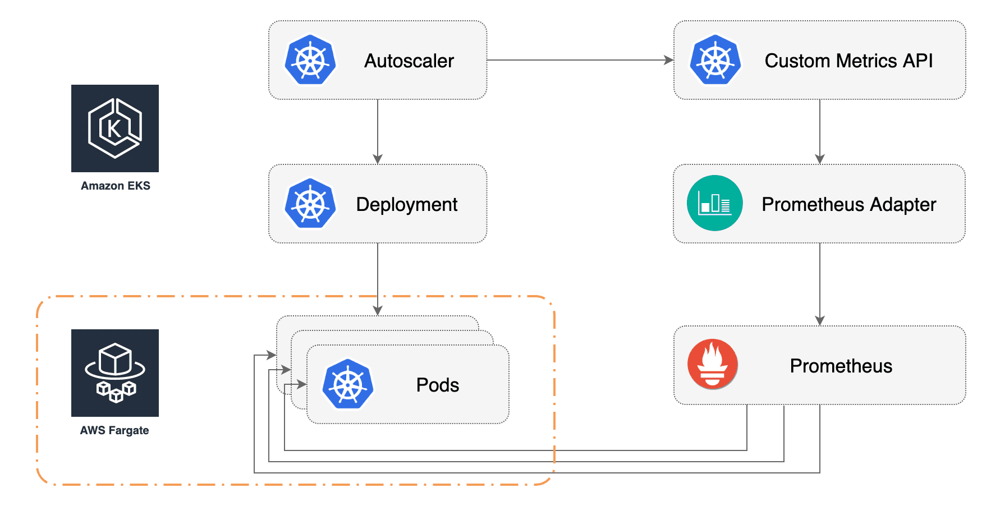

# eks-hpa-profile

This repo is an [eksctl GitOps profile](https://eksctl.io/usage/experimental/gitops-flux/)
for configuring HPA with metrics provided by Prometheus to automatically scale pods running on EKS on Fargate. 



### Create an EKS cluster

Create an EKS cluster with two EC2 managed nodes and a Fargate profile:

```sh
cat << EOF | eksctl create cluster -f -
apiVersion: eksctl.io/v1alpha5
kind: ClusterConfig
metadata:
  name: eks-fargate-hpa
  region: eu-west-1

managedNodeGroups:
  - name: default
    instanceType: m5.large
    desiredCapacity: 2
    volumeSize: 120
    iam:
      withAddonPolicies:
        appMesh: true
        albIngress: true

fargateProfiles:
  - name: default
    selectors:
      - namespace: demo
        labels:
          scheduler: fargate
EOF
```

You'll use the managed nodes for cluster add-ons(CoreDNS, KubeProxy) and for the HPA metrics add-ons:
* [Prometheus](https://github.com/stefanprodan/eks-hpa-profile/blob/master/monitoring-system/prometheus.yaml) - scrapes pods and stores metrics
* [Prometheus metrics adapter](https://github.com/stefanprodan/eks-hpa-profile/blob/master/monitoring-system/prometheus-adapter.yaml) - queries Prometheus and exposes metrics for the Kubernetes custom metrics API
* [Metrics server](https://github.com/stefanprodan/eks-hpa-profile/blob/master/monitoring-system/metrics-server.yaml) - collects pods CPU and memory usage and exposes metrics for the Kubernetes resource metrics API

You'll use Fargate for the demo application [podinfo](https://github.com/stefanprodan/eks-hpa-profile/tree/master/demo/podinfo),
note that only the pods deployed in the `demo` namespace with a `scheduler: fargate` label will be running on Fargate.

### Create a GitHub repository

To configure HPA for Fargate you'll be using an eksctl GitOps [profile](https://eksctl.io/gitops-quickstart/setup-gitops/). 
A Profile allows you to create a specific Kubernetes application platform tailored for a specific use case.

Create a GitHub [repository](https://github.com/new) and clone it locally.
Replace `GH_USER/GH_REPO` value with your GitHub username and new repo.
Use these variables to clone your repo and setup GitOps for your cluster.

```sh
export GH_USER=YOUR_GITHUB_USERNAME
export GH_REPO=YOUR_GITHUB_REPOSITORY

git clone https://github.com/${GH_USER}/${GH_REPO}
cd ${GH_REPO}
```

Run the eksctl repo command:

```sh
export EKSCTL_EXPERIMENTAL=true

eksctl enable repo \
--cluster=eks-fargate-hpa \
--region=eu-west-1 \
--git-url=git@github.com:${GH_USER}/${GH_REPO} \
--git-user=fluxcd \
--git-email=${GH_USER}@users.noreply.github.com
```

The command `eksctl enable repo` takes an existing EKS cluster and an empty repository 
and sets up a GitOps pipeline.

After the command finishes installing [FluxCD](https://github.com/fluxcd/flux) and [Helm Operator](https://github.com/fluxcd/flux),
you will be asked to add Flux's deploy key to your GitHub repository.

Copy the public key and create a deploy key with write access on your GitHub repository.
Go to `Settings > Deploy keys` click on `Add deploy key`, check `Allow write access`,
paste the Flux public key and click `Add key`.

Once that is done, Flux will be able to pick up changes in the repository and deploy them to the cluster.

### Install the metrics add-ons

Run the eksctl profile command:

```sh
eksctl enable profile \
--name=https://github.com/stefanprodan/eks-hpa-profile \
--cluster=eks-fargate-hpa \
--region=eu-west-1 \
--git-url=git@github.com:${GH_USER}/${GH_REPO} \
--git-user=fluxcd \
--git-email=${GH_USER}@users.noreply.github.com
```

The command `eksctl enable profile` adds the HPA metrics add-ons and
the demo app manifests to the configured repository.

Sync your local repository with:

```sh
git pull origin master
```

Install [fluxctl](https://github.com/fluxcd/flux/releases):

```sh
curl -sL https://fluxcd.io/install | sh
export PATH="$PATH:$HOME/.fluxcd/bin"
```

Run the fluxctl sync command to apply the manifests on your cluster:

```sh
fluxctl sync --k8s-fwd-ns flux
```

Flux does a git-cluster reconciliation every five minutes,
the above command can be used to speed up the synchronization.

List the installed components:

```
$ kubectl -n monitoring-system get helmreleases

NAME                 RELEASE              STATUS
metrics-server       metrics-server       DEPLOYED
prometheus           prometheus           DEPLOYED
prometheus-adapter   prometheus-adapter   DEPLOYED
```

### Install podinfo

You'll use a Go web app named [podinfo](https://github.com/stefanprodan/podinfo) to try out HPA.
The app is instrumented with Prometheus and exposes the `http_requests_total` [counter](https://prometheus.io/docs/concepts/metric_types/#counter).
The HPA controller will scale the pods running on Fargate based on the number of requests per second.

Install podinfo by setting `fluxcd.io/ignore` to `false` in base/demo/namespace.yaml:

```sh
cat << EOF | tee base/demo/namespace.yaml
apiVersion: v1
kind: Namespace
metadata:
  name: demo
  annotations:
    fluxcd.io/ignore: "false"
EOF
```

Apply changes via git:

```sh
git add -A && \
git commit -m "init demo" && \
git push origin master && \
fluxctl sync --k8s-fwd-ns flux
```

Wait for Fargate to schedule and start podinfo:

```sh
watch kubectl -n demo get po -l scheduler=fargate
```

When podinfo starts, Prometheus will scrape the metrics endpoint and the Prometheus adapter will export the HTTP 
requests per second metrics to the Kubernetes custom metrics API:

```
$ watch kubectl get --raw /apis/custom.metrics.k8s.io/v1beta1 | jq .

{
  "kind": "APIResourceList",
  "apiVersion": "v1",
  "groupVersion": "custom.metrics.k8s.io/v1beta1",
  "resources": [
    {
      "name": "namespaces/http_requests_per_second",
      "singularName": "",
      "namespaced": false,
      "kind": "MetricValueList",
      "verbs": [
        "get"
      ]
    },
    {
      "name": "pods/http_requests_per_second",
      "singularName": "",
      "namespaced": true,
      "kind": "MetricValueList",
      "verbs": [
        "get"
      ]
    }
  ]
}
``` 

### Configure autoscaling based on HTTP traffic

To configure auto-scaling you can set up a HPA definition that uses the `http_requests_per_second` metric. 
The HPA manifest is in `base/demo/podinfo.hpa.yaml` and it's set to scale up podinfo
when the average req/sec per pod goes over 10:

```yaml
apiVersion: autoscaling/v2beta1
kind: HorizontalPodAutoscaler
metadata:
  name: podinfo
  namespace: demo
spec:
  scaleTargetRef:
    apiVersion: apps/v1
    kind: Deployment
    name: podinfo
  minReplicas: 1
  maxReplicas: 10
  metrics:
    - type: Pods
      pods:
        metricName: http_requests_per_second
        targetAverageValue: 10
```

Note that the podinfo [deployment manifest](https://github.com/stefanprodan/eks-hpa-profile/blob/master/demo/podinfo/deployment.yaml)
has no replicas defined in `deployment.spec.replicas`, the HPA controller updates the number of replicas based on the metric average value.

Once the metric is available to the metrics API, the HPA controller will display the current value:

```
$ watch kubectl -n demo get hpa

NAME      REFERENCE            TARGETS   MINPODS   MAXPODS   REPLICAS   AGE
podinfo   Deployment/podinfo   200m/10   1         10        1          8m58s
```

The m in `200m` represents milli-units, 200m means 0.2 req/sec.
The traffic is generated by Prometheus that scrapes the `/metrics` endpoint every five seconds.

Exec into the loadtester pod with:

```sh
kubectl -n demo exec -it loadtester-xxxx-xxxx
```

Generate traffic with `hey`:

```sh
hey -z 10m -c 5 -q 5 -disable-keepalive http://podinfo.demo
```

After a few minutes the HPA begins to scale up the deployment:

```
$ kubectl -n demo describe hpa podinfo

Events:
  Type    Reason             Age   From                       Message
  ----    ------             ----  ----                       -------
  Normal  SuccessfulRescale  2m    horizontal-pod-autoscaler  New size: 3; reason: pods metric http_requests_per_second above target
```

After the load tests finishes, the HPA down scales the deployment to it's initial replicas:

```
Events:
  Type    Reason             Age   From                       Message
  ----    ------             ----  ----                       -------
  Normal  SuccessfulRescale  21s   horizontal-pod-autoscaler  New size: 1; reason: All metrics below target
```

You may have noticed that the autoscaler doesn't react immediately to usage spikes.
By default the metrics sync happens once every 30 seconds and scaling up/down can only happen
if there was no rescaling within the last 3-5 minutes.
In this way, the HPA prevents rapid execution of conflicting decisions.

### Configure autoscaling based on CPU usage

For workloads that aren't instrumented with Prometheus, you can use the Kubernetes
[metrics server](https://github.com/stefanprodan/eks-hpa-profile/blob/master/monitoring-system/metrics-server.yaml)
and configure auto-scaling based on CPU and/or memory usage.

Update the HPA manifest by replacing the HTTP metric with CPU average utilization:

```sh
cat << EOF | tee base/demo/podinfo/hpa.yaml
apiVersion: autoscaling/v2beta1
kind: HorizontalPodAutoscaler
metadata:
  name: podinfo
  namespace: demo
spec:
  scaleTargetRef:
    apiVersion: apps/v1
    kind: Deployment
    name: podinfo
  minReplicas: 1
  maxReplicas: 10
  metrics:
    - type: Resource
        resource:
          name: cpu
          targetAverageUtilization: 90
EOF
```

Apply changes via git:

```sh
git add -A && \
git commit -m "cpu hpa" && \
git push origin master && \
fluxctl sync --k8s-fwd-ns flux
```

Run a load test to increase CPU usage above 90% to trigger the HPA:

```sh
hey -z 10m -c 5 -q 5 -m POST -d 'test' -disable-keepalive http://podinfo.demo/token
```

The Kubernetes Metrics Server is a cluster-wide aggregator of resource usage data,
it collects CPU and memory usage for nodes and pods by pooling data from the `kubernetes.summary_api`.
The summary API is a memory-efficient API for passing data from Kubelet to the metrics server.

### Configure autoscaling based on App Mesh traffic

One of the advantages of using a service mesh like App Mesh is the builtin monitoring capability.
You don’t have to instrument your web apps in order to monitor the L7 traffic.

The Envoy sidecar used by App Mesh exposes a counter `envoy_cluster_upstream_rq`, you can configure the
[Prometheus adapter](https://github.com/stefanprodan/eks-hpa-profile/blob/master/monitoring-system/prometheus-adapter.yaml)
to transform this metric into req/sec rate with:

```yaml
apiVersion: helm.fluxcd.io/v1
kind: HelmRelease
metadata:
  name: prometheus-adapter
  namespace: monitoring-system
spec:
  releaseName: prometheus-adapter
  chart:
    repository: https://kubernetes-charts.storage.googleapis.com/
    name: prometheus-adapter
    version: 1.4.0
  values:
    prometheus:
      url: http://prometheus.monitoring-system
      port: 9090
    rules:
      default: false
      custom:
        - seriesQuery: 'envoy_cluster_upstream_rq{kubernetes_namespace!="",kubernetes_pod_name!=""}'
          resources:
            overrides:
              kubernetes_namespace: {resource: "namespace"}
              kubernetes_pod_name: {resource: "pod"}
          name:
            matches: "envoy_cluster_upstream_rq"
            as: "appmesh_requests_per_second"
          metricsQuery: 'sum(rate(<<.Series>>{<<.LabelMatchers>>}[1m])) by (<<.GroupBy>>)'
```

Now you can use the `appmesh_requests_per_second` metric in the HPA definition:

```yaml
apiVersion: autoscaling/v2beta1
kind: HorizontalPodAutoscaler
metadata:
  name: podinfo
  namespace: demo
spec:
  scaleTargetRef:
    apiVersion: apps/v1
    kind: Deployment
    name: podinfo
  minReplicas: 1
  maxReplicas: 10
  metrics:
    - type: Pods
      pods:
        metricName: appmesh_requests_per_second
        targetAverageValue: 10
```

